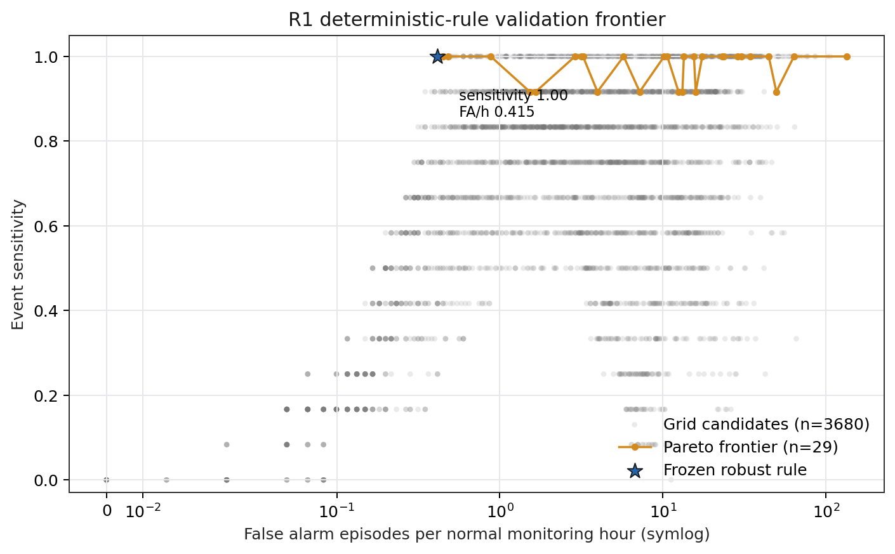
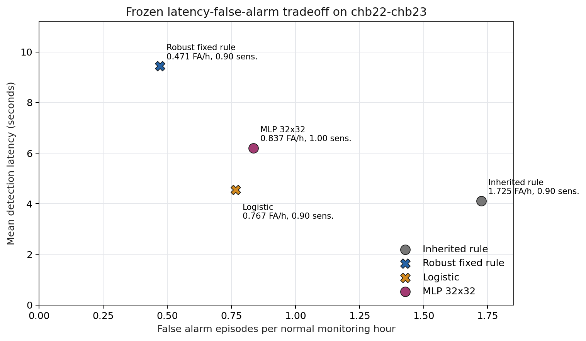
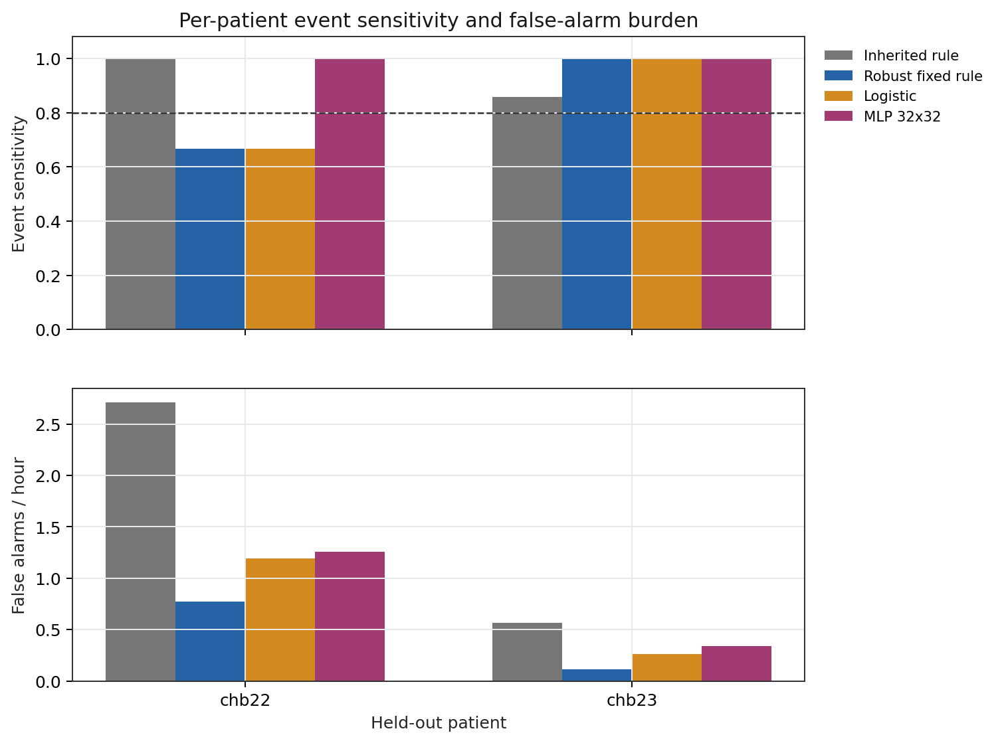
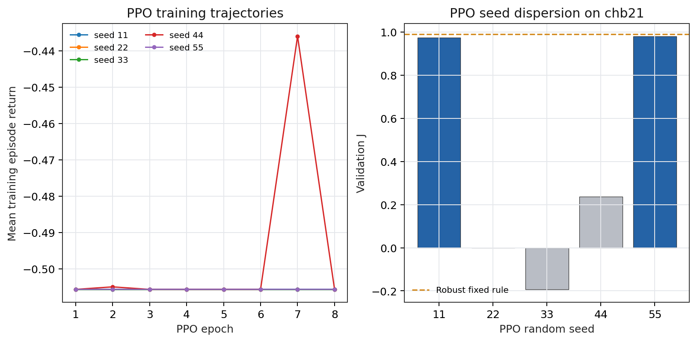
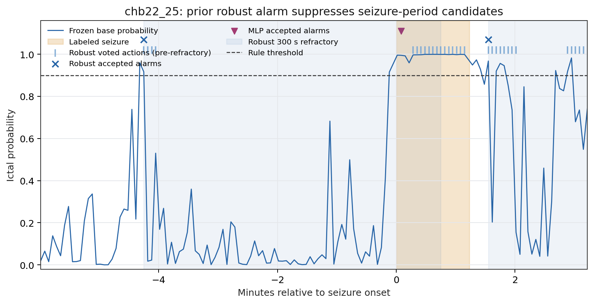

# EEG Alarm-Policy R1-R4 Evaluation Report

## Technical summary

The frozen Scheme C S1 base probabilities remain highly rank-discriminative on chb22-chb23 (AUROC **0.9945**, AUPRC **0.5285**). The primary robust fixed rule reduced false alarms to **0.471/hour**, but detected 9/10 events and failed the predeclared per-patient sensitivity guardrail because chb22 was 2/3.

The frozen 32x32 MLP comparator detected **10/10 events** at **0.837 false alarms/hour** and passed the pooled and per-patient guardrail. The inherited rule also passed, but detected 9/10 events at 1.725 false alarms/hour. This is evidence that recent probability-trajectory shape can improve alarm decisions. It is not an independently confirmed promotion: the MLP became the apparent winner after observing the single final cohort.

PPO was not evaluated on chb22-chb23 because it failed its frozen promotion gate. Its median-seed policy achieved validation J=0.2374 and event sensitivity=0.25; the robust fixed rule remained stronger and substantially more stable. RL is therefore not justified by this experiment.

## Fixed rules expose a sensitivity-false-alarm frontier

R1 searched deterministic threshold, voting, and refractory controls jointly on chb20-chb21. The selected rule (`threshold=0.90`, `2-of-5`, `300 s`) detected 12/12 validation events at 0.415 false alarms/hour. The patient-level guardrail was added specifically to reject rules whose pooled score hides a weak patient.

## Frozen final comparison favors the compact MLP

Lower-left is preferred in this latency-false-alarm view; point labels retain event sensitivity, and X markers indicate a failed sensitivity guardrail. The robust rule has the lowest false-alarm burden, but its missed chb22 event causes the guardrail failure. The inherited 60-second rule alarms much more often. The logistic control also misses a chb22 event. The MLP trades 0.366 additional false alarms/hour versus the robust rule for complete event detection in this cohort.

| Method | AUROC | AUPRC | Events | Event sens. | FA/h | Latency s | Window F1 | J | Guardrail |
|---|---:|---:|---:|---:|---:|---:|---:|---:|:---:|
| Inherited rule | n/a | n/a | 9/10 | 0.900 | 1.725 | 4.11 | 0.363 | 0.8654 | yes |
| Robust fixed rule | n/a | n/a | 9/10 | 0.900 | 0.471 | 9.44 | 0.469 | 0.8904 | no |
| Logistic | 0.9935 | 0.2605 | 9/10 | 0.900 | 0.767 | 4.56 | 0.457 | 0.8846 | no |
| MLP 32x32 | 0.9702 | 0.2014 | 10/10 | 1.000 | 0.837 | 6.20 | 0.409 | 0.9832 | yes |

AUROC/AUPRC are reported only for learned score-producing controls. The fixed-rule rows operate directly on the unchanged base probabilities; their ranking metrics are the base AUROC/AUPRC above rather than new model scores.

## Patient-level results reveal the chb22 failure mode

| Patient | Method | Events | Event sens. | FA/h | Latency s |
|---|---|---:|---:|---:|---:|
| chb22 | Inherited rule | 3/3 | 1.000 | 2.715 | 9.00 |
| chb22 | Robust fixed rule | 2/3 | 0.667 | 0.776 | 17.00 |
| chb22 | Logistic | 2/3 | 0.667 | 1.196 | 7.00 |
| chb22 | MLP 32x32 | 3/3 | 1.000 | 1.260 | 6.33 |
| chb23 | Inherited rule | 6/7 | 0.857 | 0.567 | 1.67 |
| chb23 | Robust fixed rule | 7/7 | 1.000 | 0.113 | 7.29 |
| chb23 | Logistic | 7/7 | 1.000 | 0.265 | 3.86 |
| chb23 | MLP 32x32 | 7/7 | 1.000 | 0.340 | 6.14 |

The final cohort contains only two patients and ten seizures, so one missed chb22 event moves that patient's sensitivity from 1.00 to 0.67. The apparent MLP advantage is meaningful for this cohort but has wide sampling uncertainty.

## PPO is unstable and does not beat simpler controls

On chb21, the robust fixed rule reached J=0.9904; logistic reached J=0.9882; MLP reached J=0.9876. PPO results varied sharply by seed, and the predeclared median-J seed failed the sensitivity guardrail. A tabular Q policy worked better than selected PPO but still did not beat the robust rule.

## A missed event shows why temporal shape matters

For chb22_25, the base probability and voted actions rise around the labeled event, but a prior accepted robust alarm places the event inside the 300-second refractory interval. The MLP combines eight causal probability samples with enrollment distribution summaries, slope, variance, and a record-start flag. It emits an alarm without using future samples or labels as inputs.

## Scope and metric definitions

- Frozen base model: Qwen2.5-0.5B `visual_mean`, E1+E2+E3+E4, STFT 128/128/32.
- Policy development: chb20 for supervised/RL fitting; chb21 for supervised/RL selection; R1 robust grid used chb20-chb21 jointly.
- Final evaluation: chb22-chb23, exported once after the protocol freeze.
- Event sensitivity: detected labeled seizure events divided by all labeled events.
- False alarms/hour: alarm episodes overlapping no seizure divided by normal monitoring hours.
- Latency: seconds from seizure onset to the first overlapping accepted alarm.
- Guardrail: pooled event sensitivity >=0.80 and every patient event sensitivity >=0.80.
- J: event sensitivity - 0.02 x FA/hour - 0.001 x normalized latency.

## Experimental controls and audit trail

The test export was locked until `r4_protocol_freeze_c24812a0fede.json` existed. The freeze fixed all rule thresholds, supervised checkpoints, objective weights, seed policy, and the exclusion of PPO. Final evaluation reloaded checkpoint SHA256 values and prediction artifact IDs and did not perform threshold search. The exported base metrics reproduce the authoritative S1 result exactly.

## Limitations

- The final sample is two patients and ten events; it is insufficient for a clinical claim.
- chb01 and chb21 share a subject identity, so this remains the fast Tier A benchmark.
- R1 used chb20-chb21 jointly, whereas supervised and RL methods fit chb20 and selected on chb21.
- The MLP result is a frozen comparator result, but selecting it now would be post-test selection.
- The alarm reward and J weights encode one operating preference, not a validated clinical utility.

## Recommended next steps

1. Freeze the MLP as the next candidate and confirm it on a new untouched patient cohort or dataset.
2. Run Tier B with grouped chb01/chb21 and out-of-fold base probabilities for policy fitting.
3. Add bootstrap confidence intervals over patients and seizure events; do not rely on point estimates alone.
4. Diagnose chb22_25 and compare MLP calibration against a non-neural temporal model with monotonic constraints.
5. Resume RL only after adding more policy-training patients and require it to beat both MLP and fixed-rule frontiers.

## Further questions

- Does the MLP advantage persist when every policy-training probability is out-of-fold?
- Which of slope, variance, enrollment quantiles, and raw history produces the chb22 gain?
- Can a calibrated sequence model retain 10/10 detection while reducing the MLP's 0.837 FA/hour?

## Result identities

- R1 result SHA256: `2723796193be80ff05ea9049179c0e5798baa7915619f3790caef5bfd3e9a742`
- R2 result SHA256: `34d4ab7abb92e7560ed14a94cd2cb4c0f840fffc551d24c1c5c0819cc6c50fe8`
- R3 result SHA256: `bdf87d987ba3cfe87023cdd087f2c8bd80fb078a865023cffd859a3ede031f99`
- R4 result SHA256: `0632a4cc02d5e76c878763bcb606190c067fce985c3eb3205a77994e286cd835`
- Final chb22 artifact: `2f79674018a667aa3197489ac337aed8813ac272e79d69d21fb30f72a839feed`
- Final chb23 artifact: `4adec915815544de955fbd5390ade59a7e2c645bcaef9026701391e64bdd6d46`
